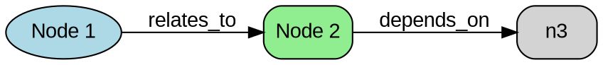

# Knowledge Graph Generators

This directory contains Rust scripts for generating various types of graph data for testing and development purposes.

## Prerequisites

These scripts require Rust and Cargo to be installed. They also depend on the following crates:
- `rand`: For random data generation
- `serde_json`: For JSON serialization/deserialization
- `csv`: For CSV file handling

Add these dependencies to your Cargo.toml:

```toml
[dependencies]
rand = "0.8"
serde_json = "1.0"
csv = "1.1"
```

## Available Generators

### JSON Graph Generator

Generates a knowledge graph in JSON format with nodes and edges.

```bash
cargo run --bin generate_json_graph [output_path] [node_count]
```

- `output_path`: Path to save the generated JSON file (default: "docs/sample/generated_graph.json")
- `node_count`: Number of nodes to generate (default: 50)

### CSV Graph Generator

Generates either a node list or edge list in CSV format.

```bash
cargo run --bin generate_csv_graph [format] [output_path] [count]
```

- `format`: Either "nodes" or "edges" (default: "nodes")
- `output_path`: Path to save the generated CSV file (default depends on format)
- `count`: Number of nodes or edges to generate (default: 50)

### DOT Graph Generator

Generates a graph in DOT format for use with Graphviz.

```bash
cargo run --bin generate_dot_graph [output_path] [node_count] [is_directed]
```

- `output_path`: Path to save the generated DOT file (default: "docs/sample/generated_graph.dot")
- `node_count`: Number of nodes to generate (default: 30)
- `is_directed`: "directed" for a directed graph, anything else for undirected (default: directed)

### Layout Graph Generator

Generates a graph with layout-specific structure and options.

```bash
cargo run --bin generate_layout_graph [output_path] [layout_type] [node_count]
```

- `output_path`: Path to save the generated JSON file (default: "docs/sample/layout_graph.json")
- `layout_type`: One of "fcose", "cose-bilkent", "cise", "concentric", "klay", "dagre" (default: "fcose")
- `node_count`: Number of nodes to generate (default: 50)

### Domain Graph Generator

Generates a domain-specific knowledge graph.

```bash
cargo run --bin generate_domain_graph [domain] [output_path] [node_count]
```

- `domain`: One of "programming", "science", "business", "medicine" (default: "programming")
- `output_path`: Path to save the generated JSON file (default: "docs/sample/{domain}_graph.json")
- `node_count`: Number of nodes to generate (default: 50)

### Large Graph Generator

Generates a large graph for performance testing.

```bash
cargo run --bin generate_large_graph [output_path] [node_count] [edge_density]
```

- `output_path`: Path to save the generated JSON file (default: "docs/sample/large_graph.json")
- `node_count`: Number of nodes to generate (default: 1000)
- `edge_density`: Edge density between 0.0 and 1.0 (default: 0.01)

### Run All Generators

Run all generators with predefined parameters to create a set of sample graphs.

```bash
cargo run --bin run_generators
```

This will create various sample graphs in the docs/sample directory.

## Output Formats

### JSON Format

The JSON format consists of a root object with "nodes" and "edges" arrays:

```json
{
  "nodes": [
    {
      "id": "n1",
      "label": "Node 1",
      "x": 100,
      "y": 100,
      "type": "concept",
      "additional_field1": "value1",
      ...
    },
    ...
  ],
  "edges": [
    {
      "source": "n1",
      "target": "n2",
      "type": "relates_to",
      "weight": 0.8,
      ...
    },
    ...
  ]
}
```

### CSV Format

#### Node List CSV

```
id,label,x,y,type,importance,description,...
n1,Node 1,100,200,concept,0.8,"Description of node 1",...
n2,Node 2,150,250,person,0.7,"Description of node 2",...
...
```

#### Edge List CSV

```
id,source,target,type,weight,label
e1,n1,n2,relates_to,0.8,"Relates to"
e2,n2,n3,depends_on,0.6,"Depends on"
...
```

### DOT Format


